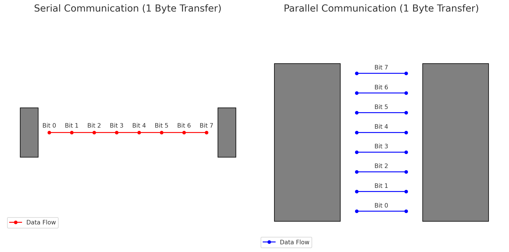
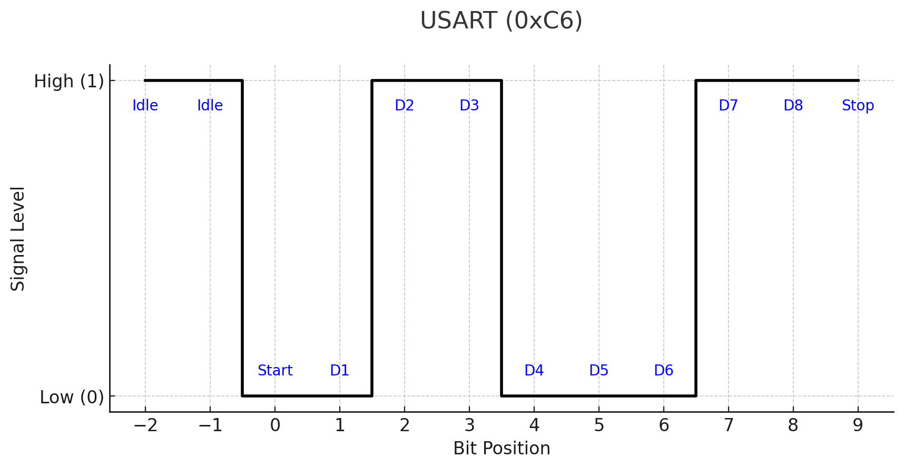
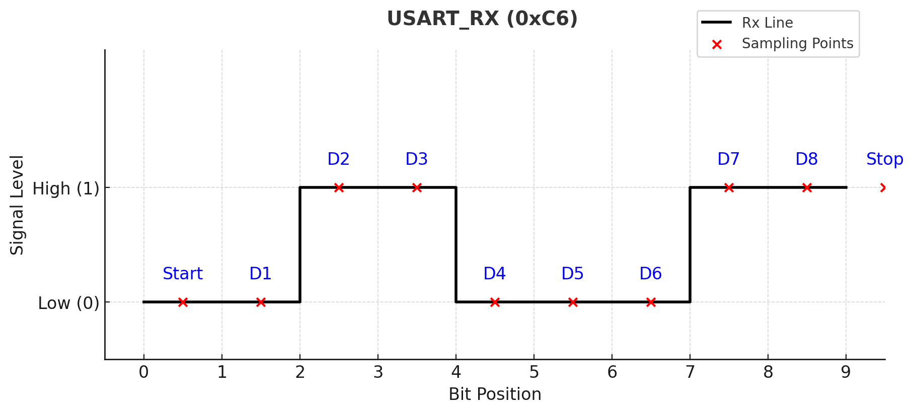

# Verilog USART Implementation (`verilog_usart`)

## Overview
This project implements a **USART** in Verilog. The design includes two main components:
- **USART Transmitter (`usart_tx`)**: Handles serial data transmission.
- **USART Receiver (`usart_rx`)**: Handles serial data reception.

This implementation is intended for understanding USART communication systems.

## Project Structure
The project consists of the following main modules:
- **`usart_tx`**: Responsible for data transmission.
- **`usart_rx`**: Responsible for data reception.

## Communication Methods Overview
- **Serial Communication**: Sends data sequentially over a single line.
- **Parallel Communication**: Sends data simultaneously over multiple lines.

  

## What is USART?
A **USART** is a serial communication interface that supports both **synchronous** and **asynchronous** communication methods.

## How Does It Work?
  

1. **Idle State**: The line remains high (logic `1`) when no data is being transmitted.
2. **Start State**: The line transitions to low (logic `0`) to signal the beginning of data transmission.
3. **Data State**: Data is transmitted or received sequentially from bit 0 (LSB) to bit 7 (MSB).
4. **Stop State**: The line returns to high (logic `1`) to indicate the end of transmission.

## Baud Rate
- Baud rate is measured in **bps (bits per second)**.
- For example, a baud rate of **9600 bps** means 9600 bits are transmitted in 1 second.

## State Machine
- **Idle State**: Line is high (`1`).
- **Start State**: Line transitions to low (`0`).
- **Data State**: Sends or receives data sequentially (bit 0 to bit 7).
- **Stop State**: Line returns to high (`1`).

## Calculating Baud Rate Timing
To set the correct baud rate:
- **Input Clock Frequency**: 100 MHz (T = 1/f = 10 ns per cycle).
- **Target Baud Rate**: 9600 bps (1 bit = 1/9600 ≈ 104.1667 µs).
- **Clock Cycles per Bit**:  
  - Formula: `cnt = (1 / baud rate) / (1 / clock frequency)`.
  - Calculation: `cnt = 104.1667 µs / 10 ns = 10416.67`.
  - Since ±2% error is typically acceptable in USART, round to **10416**.

## USART Receiver (`usart_rx`)
  

### State Machine
- **Idle State**: Line is high (`1`).
- **Start State**: Detects the line transitioning to low (`0`).
- **Data State**: Receives data sequentially from bit 0 to bit 7.
- **Stop State**: Line returns to high (`1`).

### Sampling Adjustment
- Simply counting 10416 clock cycles after detecting the start bit may miss the first data bit due to misalignment.
- **Solution**: Wait **half a bit period** (10416 / 2 = 5208 clock cycles) after the start bit to align sampling with the middle of the first bit.
- Then, count 10416 cycles for each subsequent bit to sample data accurately.

## USART Transmitter (`usart_tx`)
  

### State Machine
- **Idle State**: Line is high (`1`).
- **Start State**: Sets the line to low (`0`).
- **Data State**: Transmits data sequentially from bit 0 to bit 7.
- **Stop State**: Sets the line back to high (`1`).

### Transmission Timing
- The transmitter uses a fixed count of **10416 clock cycles** per bit to match the 9600 bps baud rate.